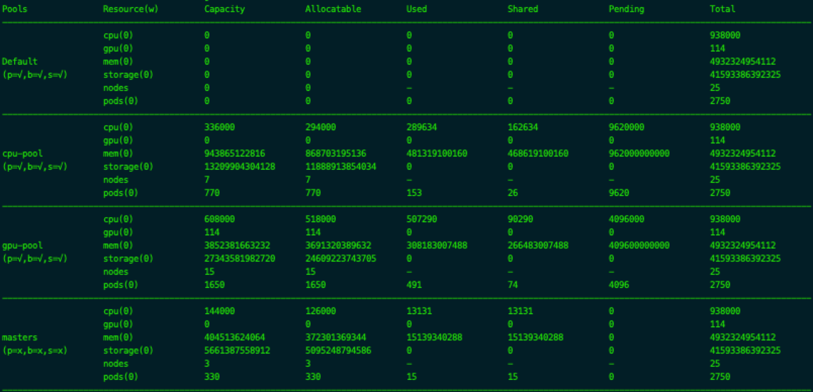

# Ai-Scheduler

Ai-Scheduler是在kubernetes默认调度器（v1.14.1）基础上进行扩展设计和改进而来，主要针对AI场景下的任务调度。AI场景下训练任务量大，需要解决如何更高效地进行调度、更合理地分配资源以及更大限度的利用资源等问题。

Ai-Scheduler最初提出是为了解决不同的异构系统中多种资源的调度问题，以提高整个集群的资源利用率。如考虑如下场景：

- （1）GPU上 vs CPU资源（GPU.cpu vs CPU.cpu）：把CPU任务和GPU任务看成两种“业务”，CPU任务正常使用CPU机器，但是在没有GPU任务的时候可以占用GPU服务器上的CPU资源。
- （2）1卡 vs 8卡任务（GPU.1u vs GPU.8u）：1卡和8卡任务是两种“业务”，1卡正常使用一套机器，在没有8卡任务的时候可以占用8卡任务机器。
- （3）多租户（TeamA vs TeamB）：比如不同团队有自己的集群，但是如果没有任务，可以让别的团队使用。

Ai-Scheduler（当前版本v0.2.0）主要实现了基于多Pool的并发资源调度、资源共享、资源抢占等功能。

## 任务调度

kubernetes默认调度器的调度过程是串行的，在AI场景下训练任务量大时，调度效率比较低，资源得不到充分利用。Ai-Scheduler实现了基于业务的并发调度功能，启动时会为每个业务方创建一个调度队列并启动调度循环，同时对多个任务进行调度。

调度器为每个Pool维护一个调度队列，当Job创建时，根据pod的annotation中指定的pool名称即`resource.aibee.cn/pool`进入相应的调度队列中等待调度。示例如下：

```yaml
apiVersion: batch/v1
kind: Job
metadata:
  name: test-job-cpu
spec:
  completions: 10
  parallelism: 10
  activeDeadlineSeconds: 600
  template:
    metadata:
      annotations:
        resource.aibee.cn/pool: cpu-pool
    spec:
      schedulerName: ai-scheduler
      containers:
        - name: pi
          image: perl
          command: ["perl"]
          args: ["-Mbignum=bpi", "-wle", "print bpi(2000)"]
          imagePullPolicy: IfNotPresent
          resources:
            limits:
              cpu: 1000m
              memory: 100M
            requests:
              cpu: 1000m
              memory: 100M
      restartPolicy: Never
  backoffLimit: 3
```

> 提交如上的Job时，需注意如下几点：
>
> - 在Job的pod Template中指定annotations的**resource.aibee.cn/pool**为具体的资源池名称，如何创建资源池见下章节。
> - 指定调度器名称为**ai-scheduler**

## 资源池

### 定义

资源池Pool是指根据业务需要把一部分资源优先分配给某个业务方，这部分资源优先给该业务方进行使用的资源集合。如根据侧重gpu或者cpu资源的训练任务将集群资源划分为gpu-pool和cpu-pool，ai-scheduler实现了`pools.resource.aibee.cn`的crd，资源池类型为Pool。你可以编写Pool yaml来创建资源池，如下：

```yaml
apiVersion: resource.aibee.cn/v1alpha1
kind: Pool
metadata:
  name: demo
spec:
  nodeSelector:
    matchLabels:
      pool: "demo"
  disablePreemption: false
  disableBorrowing: false
  disableSharing: false
```

### 划分

资源池是所有资源的集合，首先需要对资源进行隔离和划分，资源划分的依据主要从业务对资源的各种需求出发，当前版本资源的划分根据节点label进行划分。

- 根据label划分资源池：资源池的划分依据主要按照k8s中namespace进行划分，划分的粒度是节点node，根据每隔node中的label进行匹配。如所有支持gpu卡的机器打上gpu=true的label，cpu的机器打上cpu=true的label，根据不同的label将节点划分到不同的资源池中。
- 根据节点支持资源类型划分：对于异构资源可以根据资源的类型对不同的节点进行隔离和划分。

#### 默认资源池

ai-scheduler启动后创建一个默认资源池，它收纳所有未分配的节点和分配冲突的节点。当节点没有打label、label无法匹配到任何pool或者label匹配到多余1个pool时，这些节点将归入默认资源池。所有未指明pool或者不能匹配到所指pool的任务会分配到默认资源池。

#### masters资源池

对于master节点，他们主要运行kubernetes核心组件，一般不允许其他任务占用master节点的资源，所以我们需要建立masters资源池将master节点的资源进行隔离，保证master节点稳定运行。

```yaml
apiVersion: resource.aibee.cn/v1alpha1
kind: Pool
metadata:
  name: masters
spec:
  nodeSelector:
    matchLabels:
      kubernetes.io/role: "master"
  disablePreemption: true
  disableBorrowing: true
  disableSharing: true
```

### 特性

围绕资源池可以更好地对资源进行管理，目前支持共享、租借和抢占特性，可以对资源池属性进行变更已得到对应的特性功能。Pool暂时支持的特性如下：

- Sharing：共享特性可以通过设置disableSharing开启或关闭。开启共享的资源池允许被其他池中的任务进行租借以得到调度，如果你想独享资源可以关闭共享。
- Borrowing：租借特性可以通过设置disableBorrowing开启或关闭。开启租借后任务可以去其他pool中查找资源，找到可租用资源后会进行租借申请，这样使得闲置资源得以利用。由于租借的资源随时可能被收回，如果你不想任务被随意终止，可以禁止租借特性。
- Preemption：抢占特性可以通过设置disablePreemption开启或者关闭。通过改进kubernetes的抢占逻辑保证本资源池优先使用权，本池的任务优先级总是高于外池任务，当资源不足时首先考虑驱逐外池任务释放资源。

### 资源统计

资源池的资源项统计并实时进行监控，可以方便了解整个资源的使用情况。目前收集了kubernetes中节点中所有pod的资源请求和消耗情况，统计的资源类型包括：CPU、GPU、Memory、Storage、Nodes、Pods，可以查看各个pool的资源容量（Capacity）、可分配的资源（Allocatable）、已使用的资源(Used)、共享的资源(Shared)以及整个cluster的资源总和（Total）。


> Pools列是所有划分的资源池，Default是默认资源池，p,b,s分别代表资源池特性Preemption，Borrowing，Sharing是否开启，开启时显示√，关闭时显示x
>
> Resource(w)列是资源类型，cpu、gpu、mem、storage是常用的计算资源cpu、gpu和存储资源内存、磁盘存储，nodes表示资源池中的节点数量，pods是所有节点可创建的总pod数量(k8s默认每个node限制110个pod)
>
> 其他列是资源统计信息，各自含义如下：
>
> Capacity是资源池总资源容量，由于某些节点设置了预留资源，Capacity值大于Allocatable值。
>
> Allocatables是资源池中可分配的总资源量。
>
> Used是已经分配使用中的资源总量。
>
> Shared是该资源池中被其他非本池中任务占用的资源总量
>
> Pending是等待调度到该资源池的pod数量。
>
> Total是整个Cluster的可调度的资源总量，是各个资源池Allocatable之和。

## 资源租借

资源池可以共享资源给其他池中任务使用，这样可以充分利用闲置资源，提高利用率。其他池中任务需要通过租借来申请共享的资源，租借协议如下：

- 资源池通过disableSharing开启或关闭共享
- 开启共享后允许其他池任务进行资源租借
- 关闭共享的资源池不接受其他池任务的租借
- 资源池通过disableBorrowing开启或关闭租借功能
- 开启租借后任务会主动去其他资源池租借资源
- 关闭租借后任务无法租借资源，而是待在本池队列中等待资源释放
- 当有多个资源池可供租借时，选择一个最合适的资源池
  - 租借资源池选中规则：空闲资源最多、任务量最少

Ai-Scheduler在资源池资源不足时，优先尝试在本池中进行抢占，抢占提名失败后再去其他资源池租借资源，资源抢占见下文。

租借资源的任务总是不稳定的，随时有可能被本池任务抢占收回，收回后的任务pod即刻被杀死，这时任务pod会重新创建，也就重新进入本池队列中等待调度。

## 任务优先级

资源调度时总是优先调度高优先级的任务，在一个开启了共享的资源池的调度队列中，会有本池的任务和来租借资源的任务，Ai-Scheduler总是优先调度本池任务。kubernetes默认调度器的优先级由PriorityClass决定，且优先级是全局的，而在Ai-Scheduler中任务优先级是动态的，会根据任务所在资源池而不同，其优先级具体规则如下：

- 本池任务优先级总是高于租借任务
- 多个本池任务之间优先级由PriorityClass决定，Priority值越大优先级越高
- 多个租借任务之间优先级由PriorityClass决定，Priority值越大优先级越高

资源抢占时也会优先驱逐优先级低的任务。

## 资源抢占

在资源池资源不够时会发生资源抢占，高优先级的任务会驱逐低优先级的任务，如有租借则收回租借的资源，以保证本池任务自身资源的使用。

本池内资源不足时资源发生抢占，抢占策略如下：

- 抢占发生条件：

  - ai-scheduler启动参数disablePreemption开启

  - 资源池属性disablePreemption=false
  - 池内任务在本池内因资源紧张调度失败时
  - 租借任务不会发生抢占

- 抢占与租借顺序：

  - 先租借再抢占：当本pool资源不够时优先租借外pool资源，如果租借失败再进行抢占本pool内任务；
  - 先抢占再租借（目前采用）：当本pool资源不够时优先抢占本pool资源，如果抢占失败再进行租借外pool资源；

- 抢占优先级：

  - 根据任务优先级进行抢占，优先抢占低优先级任务，参见上节任务优先级

抢占发生时会发生驱逐，在多个节点中筛选待驱逐的pod，其筛选规则如下：

- 所有由`schedulerName=ai-scheduler`调度的pod
- 所有租借任务(优先级设置为最小值)
- 所有优先级低于当前pod的本池任务
- 驱逐后pdb影响最小
- 最高优先级的最小
- 优先级之和最小
- 驱逐pod数量最少

在开启抢占后具体的抢占逻辑如下：

- **抢占逻辑**：
  - pod因资源缺乏调度失败后，判断pod是否是本pool内任务
    - 如果是本pool任务，开始抢占逻辑
      - 在失败节点中筛选出潜在的node作为抢占节点
      - 筛选潜在抢占节点中的优先级低于pod的所有pod作为potentialVictims：所有有ai-scheduler调度的，外池的任务，优先级低于pod的本pool任务
      - 在每个node的potentialVictims中筛选出需要驱逐的pod
      - 选出一个最终抢占的node和要驱逐的victims
      - 驱逐所有victims，更新nominatedNode
      - 如果驱逐成功，pod禁止borrow必须停留在当前pool
        - 如果不允许borrow，pod进入当前pool的unschedulableQ队列等待下一次调度循环
      - 如果驱逐失败，pod允许进行borrow，进入**租借逻辑**
    - 如果不是本pool任务，说明该pod是正在进行租借的pod，不触发抢占逻辑
      - pod允许进行borrow， 进入**租借逻辑**
- **租借逻辑**：
  - pod所在的pool是否disableBorrowing
    - 如果disabledBorrowing，pod返回自己所在的pool
    - 如果enableBorrowing，pod优先选择自己的pool再次选择资源空闲最大的pool（除去当前pool），进入对应poolQueue的activeQ，进如其他pool的调度循环

> 抢占比租借优先，保证pool对本池任务的资源分配。当pool资源不够时，首先对租借的pod进行驱逐，如果驱逐后仍然不能满足再进行租借。
>
> 当最终整个cluster资源不足时，任务返回自己的pool等待调度。
>
> 最终资源状态停留在所有pool都调度的是自己pool中的任务。
>
> 任务始终会优先在本pool中进行调度，已租借成功的任务状态不稳定随时可能被本pool中的任务驱逐。

## 编译部署

编译脚本建源码Makefile，编译、构建上传镜像使用如下命令：

```shell
$ make images
$ make push
```

Ai-Scheduler通过helm进行部署，helm部署文件源码仓库。

```shell
$ helm install aibee/ai-scheduler --name=ai-scheduler --namespace=kube-system
$ helm upgrade ai-scheduler aibee/ai-scheduler
$ helm delete ai-scheduler --purge
```

## 使用示例

### 资源池的创建

创建一个cpu节点的资源池，你可以编写如下文件来创建资源池：

```yaml
apiVersion: resource.aibee.cn/v1alpha1
kind: Pool
metadata:
  name: cpu-pool
spec:
  nodeSelector:
    matchLabels:
      cpu: "true"
  disablePreemption: false
  disableBorrowing: false
  disableSharing: false
```

运行如下命令，创建资源池，所有打了`cpu=true`的节点将纳入`cpu-pool`

```sh
kubectl apply -f cpu-pool.yaml
```

### 资源池的查询

资源池Pool可以通过kubectl命令行来进行查询

```sh
$ kubectl get pool
NAME       AGE
cpu-pool   2d3h
gpu-pool   2d3h
masters    2d3h
$ kubectl describe pool cpu-pool
Name:         cpu-pool
Namespace:
Labels:       <none>
Annotations:  
API Version:  resource.aibee.cn/v1alpha1
Kind:         Pool
Metadata:
  Creation Timestamp:  2019-05-24T05:37:07Z
  Generation:          1
  Resource Version:    28343554
  Self Link:           /apis/resource.aibee.cn/v1alpha1/pools/cpu-pool
  UID:                 f81386a7-7de5-11e9-8ce3-ac1f6b6cd636
Spec:
  Disable Borrowing:   false
  Disable Preemption:  false
  Disable Sharing:     false
  Node Selector:
    Match Labels:
      Cpu:  true
Events:     <none>
```

> describe命令后续支持展示资源池更多资源统计信息

### 资源池的删除

删除资源池，使用如下命令：

```shell
$ kubectl delete pool cpu-pool
```

> 资源池删除后，池中资源将被回收到DefaultPool，对应的调度队列会被销毁，所有待调度任务进入DefaultPool队列中重新调度。

### 资源池的修改

如果业务方需求发生变化，我们可以对资源池的属性进行修改。如业务资源需要得到保证时，可以设置资源池属性disableSharing=true，可以使用如下命令：

```shell
$ kubectl edit pool cpu-pool
```

或修改yaml文件后apply：

```shell
$ kubectl apply -f cpu-pool.yaml
```

> 注意：资源池修改时，如果修改了nodeSelector，则会发生资源池中资源变动，也会引起某些任务稳定状态变化，如某个node所在池发生变化，node上运行的任务由非租借任务变成租借任务，这可能会引起租借任务被驱逐。

### 提交任务

提交AI训练任务时需要指定pod template中的annotations，`resource.aibee.cn/pool=xxx`为创建好的资源池名称，示例如下：

```yaml
apiVersion: batch/v1
kind: Job
metadata:
  name: test-job
spec:
  completions: 130
  parallelism: 130
  activeDeadlineSeconds: 600000
  template:
    metadata:
      name: test-job
      annotations:
        resource.aibee.cn/pool: cpu-pool
    spec:
      schedulerName: ai-scheduler
      containers:
        - name: pi
          image: perl
          command: ["perl"]
          args: ["-Mbignum=bpi", "-wle", "print bpi(200000)"]
          imagePullPolicy: IfNotPresent
          resources:
            limits:
              cpu: 1000m
              memory: 100M
            requests:
              cpu: 1000m
              memory: 100M
      restartPolicy: Never
      priorityClassName: high
  backoffLimit: 3
```

> 指定`resource.aibee.cn/pool: cpu-pool`，任务将被加入cpu-pool的调度队列中进行调度，优先使用cpu-pool的资源；
>
> 指定`schedulerName: ai-scheduler`，所有任务都需要指定由Ai-Scheduler进行任务调度。
